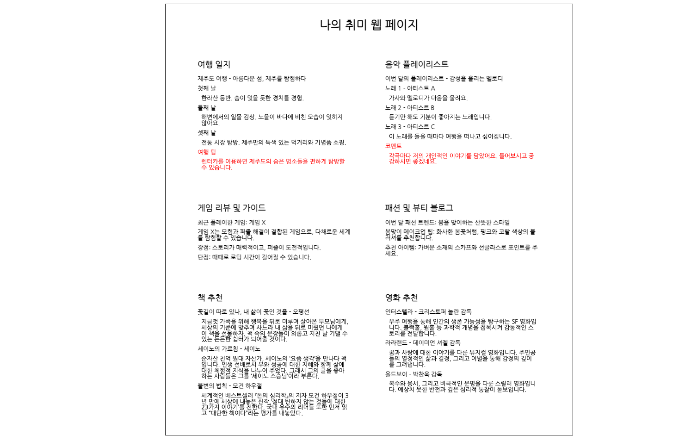

# 개인 취미 웹 페이지 프로젝트 - HTML편

  

이 프로젝트는 HTML 기초를 실습하면서, 개인의 취미와 관심사를 웹 페이지로 표현하는 방법을 배울 수 있습니다. 웹 페이지 디자인의 기본을 이해하고, 실제로 자신의 관심사를 소개하는 웹 사이트를 구축함으로써, 참여자는 웹 개발의 기본적인 아이디어와 기술을 습득할 수 있습니다.

## 프로젝트 목표

- **기초적인 웹 개발 이해**: HTML과 CSS의 기본 구조와 사용법을 학습하여, 웹 페이지의 기본적인 레이아웃과 스타일링을 할 수 있습니다.
- **창의적 표현과 개발**: 개인의 취미와 관심사를 창의적으로 표현하는 방법을 배우고, 이를 웹 페이지에 구현합니다.
- **기본적인 Layout 구성**: 각 섹션을 계획하고 사용자가 보기 편할 수 있도록 표현 하는 방법을 배웁니다.

## 프로젝트 구성

- **여행 일지**: 여행 경험과 팁을 기록하고 공유하는 섹션입니다.
- **음악 플레이리스트**: 개인적으로 좋아하는 음악을 리스트업하여 공유합니다.
- **게임 리뷰 및 가이드**: 최근 플레이한 게임에 대한 리뷰와 플레이 가이드를 제공합니다.
- **패션 및 뷰티 블로그**: 패션과 뷰티에 대한 팁과 트렌드를 공유합니다.
- **책 추천**: 영감을 주는 책들을 추천합니다.
- **영화 추천**: 볼 가치가 있는 영화들을 소개합니다.

## 프로젝트 코드 리뷰

#### HTML 기본 구조:

**`<!DOCTYPE html>`:** HTML5 문서를 정의하는 선언으로, 브라우저에게 페이지가 HTML5 문서임을 알립니다.
**`<html>`:** 페이지의 루트 요소로, 문서의 전체 내용을 감쌉니다.
**`<head>`:** 문서의 메타데이터(문서 제목, 문자 집합, 스타일 시트 링크 등)를 포함합니다.
**`<body>`:** 실제 화면에 표시되는 내용을 담고 있는 부분입니다.

#### 중요한 HTML 태그들:

**`<h1>`, `<h2>`:** 페이지와 섹션의 제목을 나타내는 데 사용됩니다.
**`
`:** 단락을 정의할 때 사용합니다.
**`<ul>`, `<li>`:** 비순차 목록을 생성할 때 사용되며, 각 목록 아이템은 `<li>` 태그로 표현됩니다.
**`
`:** 콘텐츠를 그룹화할 때 사용되며, CSS로 스타일링하거나 자바스크립트로 조작할 때 유용합니다.

#### 메타 데이터와 링크:

**`<meta charset="UTF-8">`:** 문자 인코딩을 UTF-8로 설정하여 다양한 문자가 올바르게 표시되도록 합니다.
**`<link>`:** 외부 CSS 파일이나 폰트 등을 HTML 문서에 연결할 때 사용합니다.

#### 스타일과 레이아웃:

**인라인 스타일 (style=""):** HTML 요소에 직접 스타일을 적용합니다. CSS 파일을 사용하지 않고 요소마다 스타일을 지정할 수 있습니다.
**CSS 박스 모델:** 요소의 패딩(padding), 마진(margin), 테두리(border)를 이해하고 사용하는 방법입니다.
**Flexbox:** 요소들을 유연하게 정렬할 수 있게 해주는 CSS의 중요한 기능입니다. 이 예제에서는 섹션들을 정렬하는 데 사용되었습니다.

## 결론

이 프로젝트는 참여자들이 실제로 웹 페이지를 구축하며 정보를 구조화하고, 콘텐츠를 효과적으로 전달하는 방법을 배울 수 있도록 합니다. 또한, 이 프로젝트는 참여자가 기술적, 창의적, 그리고 분석적 사고를 동시에 개발할 수 있는 기회를 제공합니다. 이러한 기술들은 다양한 역량을 갖추는 데 중요한 기초를 마련합니다. 이 프로젝트를 통해 참여자는 자신의 생각과 아이디어를 명확하게 전달하고, 다른 사람들과의 상호 작용을 향상시킬 수 있습니다.

감사합니다, 그리고 다음 시간에 뵙겠습니다. 😃😃
